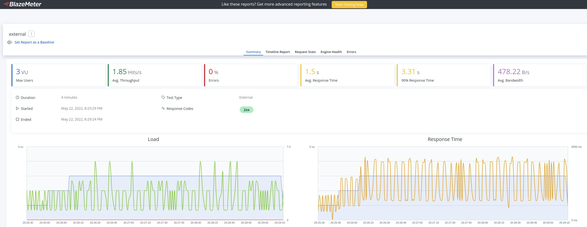
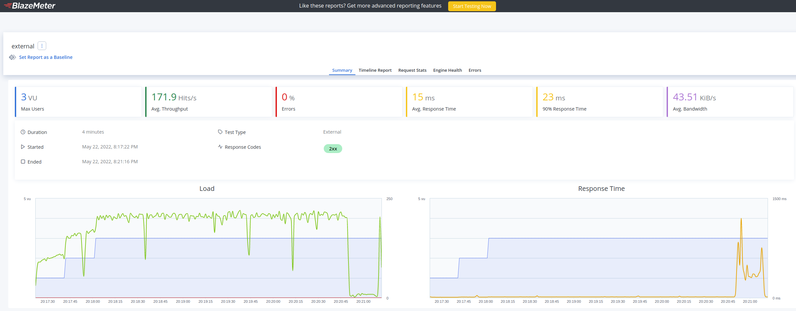
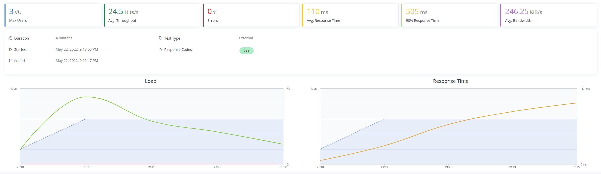
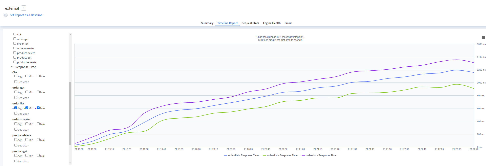

# Tasks

## Execute performance test

### Performance test before the code update

Link to [perf-test](https://a.blazemeter.com/app/?public-token=qDWvNTACjqncL05tpZ3ZKXngll3AEyEKXsV0Mxqt2AeCDWnnl6#/accounts/-1/workspaces/-1/projects/-1/sessions/r-ext-628ac65db66f0723310909/summary/summary):

### Performance test after the code update without list orders and delete products endpoints

Link to [perf-test](https://a.blazemeter.com/app/?public-token=OpNzsXWaq2g740BZLo7EyiDLsSBUnI5fSQbJKjitmQzTM28yyz#/accounts/-1/workspaces/-1/projects/-1/sessions/r-ext-628ac476db832732028682/summary/summary):

### Performance test with list orders and delete product endpoints

Link to [perf-test](https://a.blazemeter.com/app/?public-token=PaOatNG7HQYx9RSqxTHTZjAt54hCzhIVNM15zupxUgTLgcu3cI#/accounts/-1/workspaces/-1/projects/-1/sessions/r-ext-628ad2e1cd1e9985601732/summary/summary):

## Enhance product service
    - Delete product rpc call 
    - Wire into smoketest.sh (https://github.com/gitricko/nameko-devex/blob/master/test/nex-smoketest.sh ( https://github.com/gitricko/nameko-devex/blob/master/test/nex-smoketest.sh )) 
    - (bonus) Wire into perf-test 
    - (bonus) Wire unit-test for this method

## Enhance order service
    - List orders rpc call
    - Wire into smoketest.sh (https://github.com/gitricko/nameko-devex/blob/master/test/nex-smoketest.sh ( https://github.com/gitricko/nameko-devex/blob/master/test/nex-smoketest.sh )) 
    - (bonus) Wire into perf-test 
    - (bonus) Wire unit-test for this method

## Question 1: Why is performance degrading as the test run longer ?
  
  - Before the code changes:
    1. The `_get_order` method in `gateway/gateway/service.py` was fetching all the prodcuts from the Storage to get the products for an order.
    2. The `_create_order` method in `gateway/gateway/service.py` was fetching all the products from the Storage to check if the `order_data` had a valid `product_id`.
    3. The `_create_order` method in `gateapi/gateapi/api/routers/order.py` was fetching all the products from the Storage to check if the `order_data` had a valid `product_id`.

  - After the code changes:
    1. With the addition of the list orders endpoint the performance test started degrading again beacause the longer the test ran the more orders were fetched from the database as seen with this graph from Blazemeter:
  
    

## Question 2: How do you fix it ?
  - Before the code changes:
    1. I would update the `_get_order` method by changing the `product_rpc.list()` to a `product_rpc.get()` to do the enhancing the order details.
    2. I would update the `_create_order` method and replace the validation made fetching all the products using `products_rpc.list()` with `products_rpc.get()` to speed up the validation process.
    3. I would update the `_create_order` method and replace the `product_id` validation process made with `product_rpc.list()` with the `prodcut_rpc.get()` method.

  - After the code changes:
    1. Adding some sort of pagination for the list orders endpoint to limit the number of rows fetched from the database

## (bonus): Fix it
  - Fixed in this [commit](https://github.com/gian-lepear/nameko-devex/commit/d48b17abe0ca0e6e8469860bd66ecbac632acc89)
